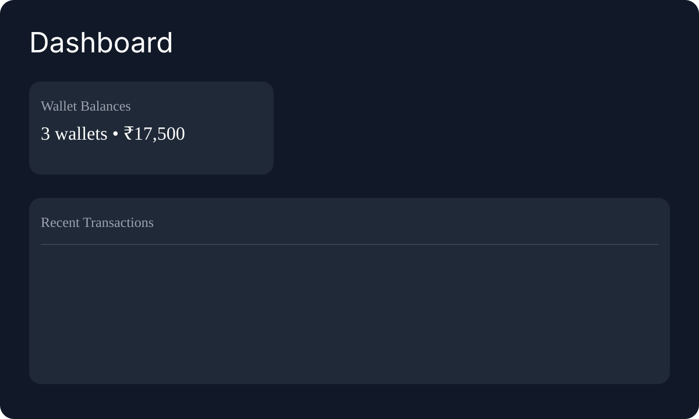
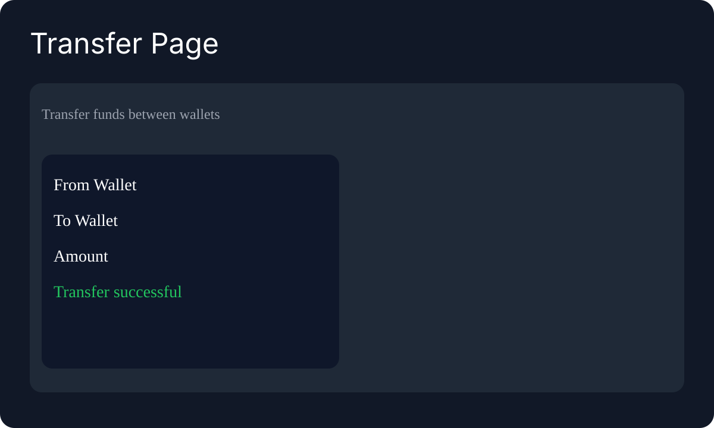
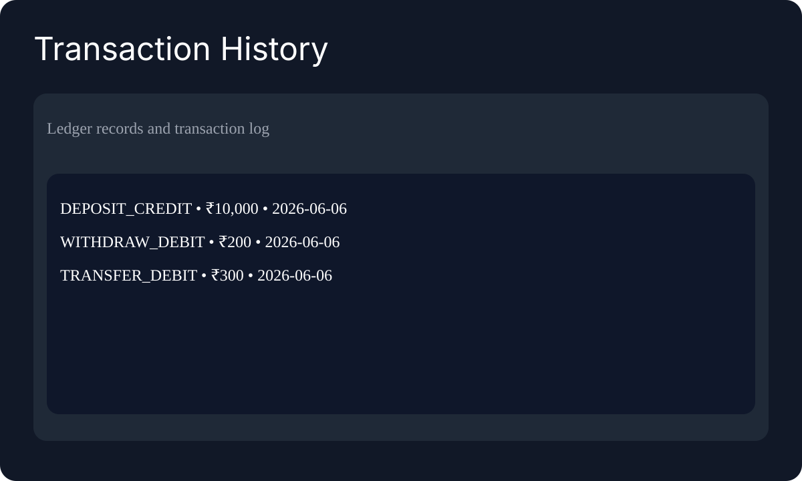
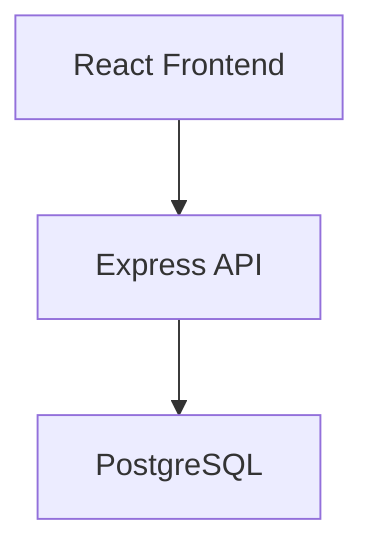

# Wallet Ledger System

A full-stack wallet ledger project with a React frontend and an Express backend.

## Architecture

```
React Frontend (Vercel)
          |
Backend API (Render)
          |
PostgreSQL (Neon)
```

## What’s included

- React frontend UI in `wallet-ledger-ui/`
- Node.js Express backend API in `src/`
- Postgres database initialization and demo seed data
- Swagger docs at `/docs`
- Idempotent deposit/withdraw/transfer behavior
- Global transaction and wallet listing APIs for the dashboard
- Docker compose support
- Integration tests

## Run backend locally

1. Install backend dependencies:

```bash
npm install
```

2. Copy `.env.example` to `.env` and set `DB_URL`.

3. Start the API:

```bash
npm run dev
```

4. Open docs:

```bash
http://localhost:3000/docs
```

## Run frontend locally

1. Change into the frontend folder:

```bash
cd wallet-ledger-ui
```

2. Install frontend dependencies:

```bash
npm install
```

3. Copy `.env.example` to `.env` and adjust `VITE_API_URL` if needed.

4. Start the app:

```bash
npm run dev
```

## Seed demo accounts

Run this after the database is initialized:

```bash
npm run seed:demo
```

This creates demo wallets with balances:
- Wallet A: ₹10,000
- Wallet B: ₹5,000
- Wallet C: ₹2,500

## Screenshots





## Run integration tests

```bash
npm test
```

## Run with Docker

```bash
docker compose up --build
```

This starts:
- `api` on port `3000`
- `postgres` on port `5432`

## API endpoints

- `POST /wallet`
- `GET /wallet/:id`
- `GET /wallets`
- `GET /wallet/:id/transactions?page=1&limit=20`
- `GET /transactions?limit=20`
- `POST /deposit`
- `POST /withdraw`
- `POST /transfer`
- `POST /wallet/:id/block`
- `POST /wallet/:id/unblock`
- `GET /docs`

## Deployment guidance

- Deploy backend to Render
- Use Neon for PostgreSQL
- Deploy frontend to Vercel

### Deployment environment variables

Backend on Render:
- `DATABASE_URL`
- `PORT`
- `NODE_ENV=production`

Frontend on Vercel:
- `VITE_API_URL=https://wallet-ledger-api.onrender.com`

### Architecture



## Resume bullet points

- Built a full-stack Wallet & Ledger System using React, Node.js, Express, and PostgreSQL supporting deposits, withdrawals, transfers, and transaction history.
- Implemented ACID-compliant money transfers using PostgreSQL transactions, row-level locking, idempotency, and double-entry accounting.
- Developed integration tests, request validation, Swagger API documentation, and a deployable cloud architecture using Vercel, Render, and Neon.

## GitHub Actions

A workflow is included at `.github/workflows/test.yml` to run `npm test -- --runInBand` on every push.
